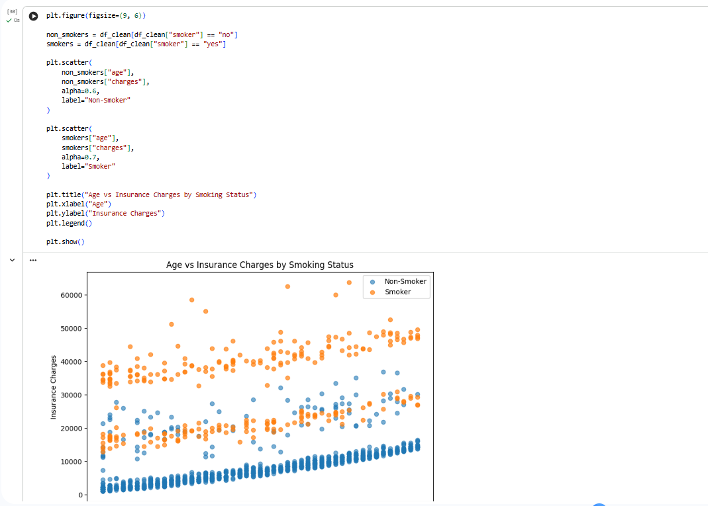
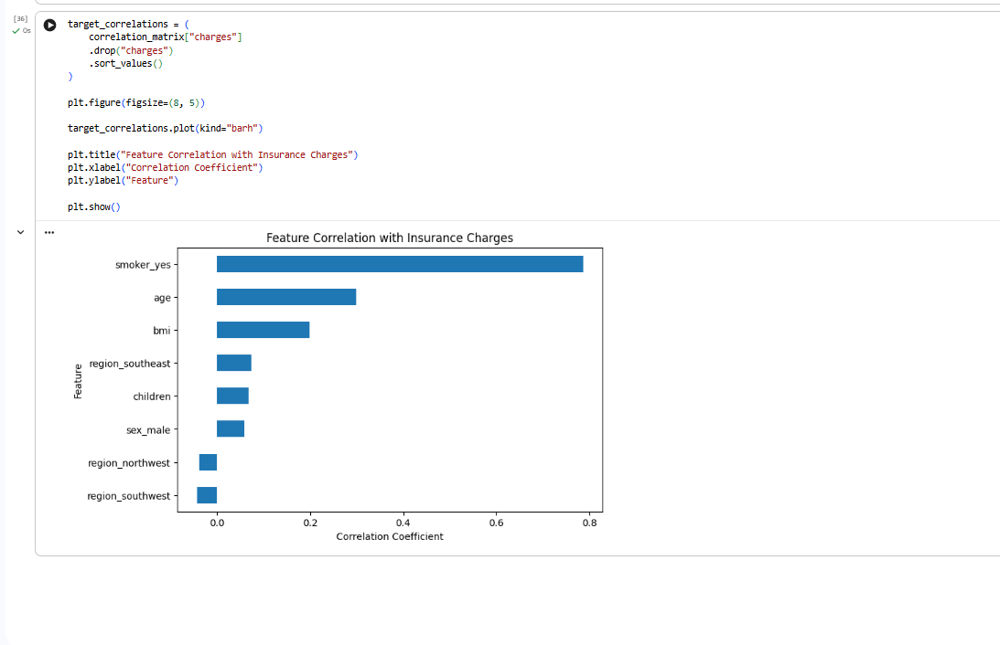
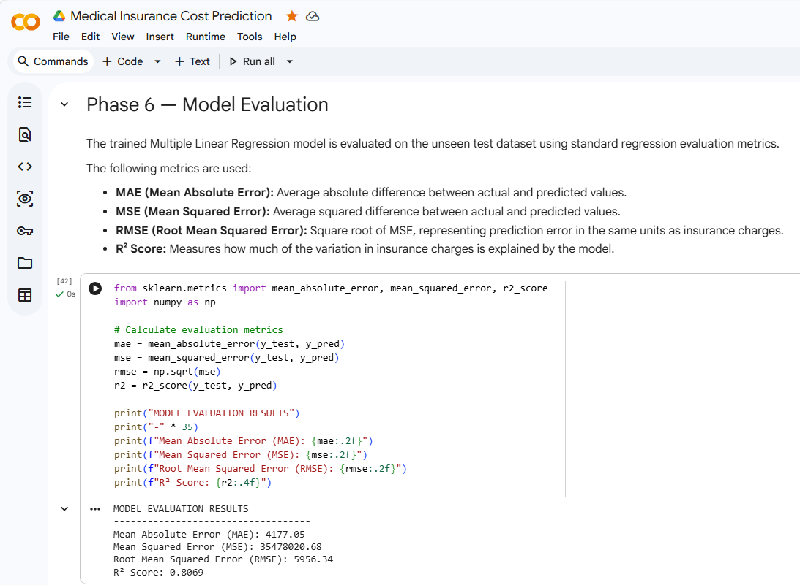
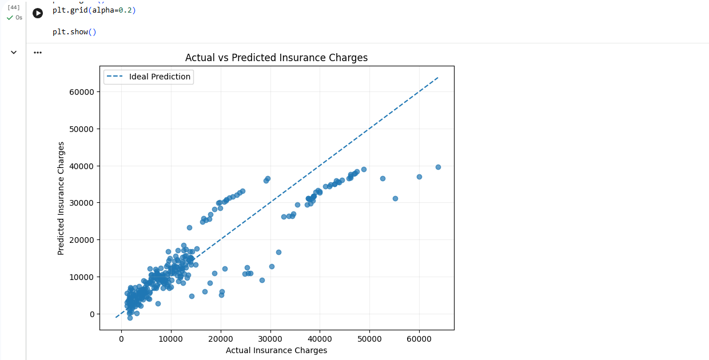
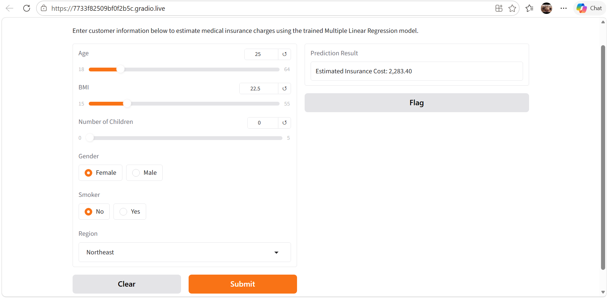
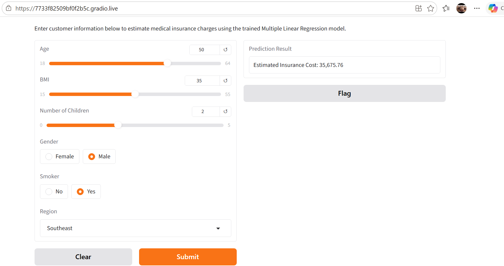

# Medical Insurance Cost Prediction

I built this project as part of my AI/ML internship to practice the complete machine learning workflow, not just the model-training step. The goal is simple: use a few customer details to estimate medical insurance charges and then make the trained model usable through a small web app.

## What the project does

The model takes these inputs:

- age
- BMI
- number of children
- gender
- smoking status
- region

and predicts the **medical insurance charge** for that profile.

Because the target (`charges`) is a continuous number, this is a **regression problem**. I used **Multiple Linear Regression** as the baseline model required for the project.

## Dataset

The project uses the **Medical Cost Personal Dataset** from Kaggle.

- File: `insurance.csv`
- Original records: **1,338**
- Columns: **7**
- Target: `charges`
- Input features: `age`, `sex`, `bmi`, `children`, `smoker`, `region`

The dataset did not contain missing values. I found one duplicate row, removed it, and continued with **1,337 records**.

## Preprocessing

I kept the preprocessing fairly simple and easy to follow:

1. checked missing values and duplicates
2. removed the duplicate record
3. reviewed data types and categorical values
4. converted `sex`, `smoker`, and `region` into numerical columns using one-hot encoding
5. kept `charges` unchanged as the target

After encoding, the model was trained with these columns:

`age`, `bmi`, `children`, `sex_male`, `smoker_yes`, `region_northwest`, `region_southeast`, `region_southwest`

## Exploratory analysis

A few patterns stood out during EDA:

- **Smoking status** had the strongest linear relationship with insurance charges (`r ≈ 0.787`).
- **Age** had a positive relationship with charges (`r ≈ 0.298`).
- **BMI** also showed a positive, but weaker, relationship (`r ≈ 0.198`).
- Average charges for smokers were around **32,050**, compared with about **8,441** for non-smokers in this dataset.

These results made smoking status the clearest signal before model training.





## Model training

I used an **80/20 train-test split** with `random_state=42` and trained a `LinearRegression` model from scikit-learn.

The test set contained **268 records**.

## Evaluation

The model was evaluated on unseen test data using standard regression metrics:

| Metric | Result |
|---|---:|
| MAE | 4,177.05 |
| MSE | 35,478,020.68 |
| RMSE | 5,956.34 |
| R² | 0.8069 |

An R² score of **0.8069** means the model explains about **80.7% of the variation** in insurance charges on the test set. I would not describe that as “80.7% accuracy” because R² is a regression metric, not classification accuracy.

The model performs reasonably well as a linear baseline, but some high-cost cases still have much larger prediction errors. The largest absolute error I observed in the test set was around **24,111**.





## Prediction app

I also connected the trained model to a small **Gradio** interface so a user can enter a profile and get a prediction without touching the notebook.

Two example profiles from testing:

- 25 years old, BMI 22.5, female, non-smoker, no children, Northeast → **2,283.40**
- 50 years old, BMI 35, male, smoker, two children, Southeast → **35,675.76**





## Project structure

```text
medical-insurance-cost-prediction/
├── README.md
├── Medical_Insurance_Cost_Prediction.ipynb
├── insurance.csv
├── app.py
├── train_model.py
├── requirements.txt
├── .gitignore
├── model/
│   ├── insurance_model.pkl
│   └── metadata.json
└── screenshots/
    ├── 01_data_exploration.png
    ├── 02_preprocessing.png
    ├── 03_eda_smoking.png
    ├── 04_feature_correlation.png
    ├── 05_model_evaluation.png
    ├── 06_actual_vs_predicted.png
    ├── 07_prediction_case_1.png
    └── 08_prediction_case_2.png
```

## Run it locally

Clone the repository and install the dependencies:

```bash
git clone <your-repository-url>
cd medical-insurance-cost-prediction
python -m venv .venv
```

Activate the environment, then run:

```bash
pip install -r requirements.txt
python app.py
```

The trained model is already included in the `model/` folder.

If you want to rebuild it from the CSV instead:

```bash
python train_model.py
```

## Deployment

The app is built with Gradio, so it can be deployed on **Hugging Face Spaces** using the same `app.py` and `requirements.txt` files in this repository.

I kept deployment separate from model training so the app can load the saved model immediately rather than retraining every time it starts.

## Limitations

This is a learning project and a baseline model, not a real insurance pricing system.

A few limitations are worth keeping in mind:

- the dataset is relatively small
- only six original input features are available
- Linear Regression assumes a mostly linear relationship between the inputs and target
- some high-cost observations are under-predicted
- real insurance pricing would need more variables, validation, fairness checks, and regulatory review

## What I would try next

If I continue this project, I would compare the linear baseline with models such as Random Forest or Gradient Boosting, use cross-validation, and move the preprocessing into a reusable scikit-learn pipeline.

For now, the main goal was to understand the full path from **raw data → preprocessing → EDA → model training → evaluation → usable prediction app**.
